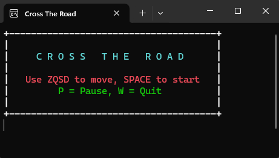
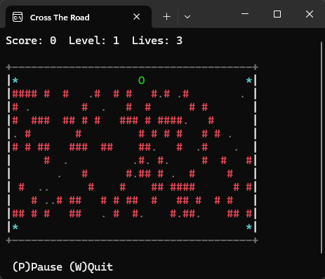
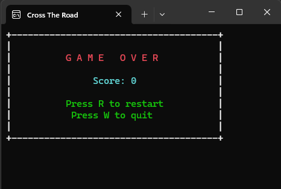

# Cross The Road

## Description
"Cross The Road" est un jeu en console inspiré de Frogger, où le joueur doit traverser une route en évitant les voitures. Le jeu est écrit en C++ et utilise la bibliothèque Windows Console API pour la gestion des couleurs et des entrées.





## Fonctionnalités
- **Déplacement du joueur** avec les touches `Z` (haut), `Q` (gauche), `S` (bas) et `D` (droite).
- **Évitez les voitures** qui se déplacent horizontalement sur différentes voies.
- **Système de score** qui augmente à chaque traversée réussie.
- **Niveaux de difficulté progressifs** où la vitesse des voitures augmente avec le score.
- **Gestion des vies** : le joueur commence avec 3 vies.
- **Écran de démarrage et écran de pause**.
- **Effets sonores** pour les collisions et les réussites.

## Installation et Exécution
### Prérequis
- Un système Windows (le jeu utilise `windows.h`)
- Un compilateur compatible C++ (MinGW, MSVC, etc.)

### Compilation
1. Ouvrez un terminal ou une invite de commande.
2. Compilez le programme avec g++ (si vous utilisez MinGW) :
   ```sh
   g++ -o CrossTheRoad.exe CrossTheRoad.cpp -static-libgcc -static-libstdc++
   ```
3. Exécutez le programme :
   ```sh
   CrossTheRoad.exe
   ```

## Commandes du Jeu
| Touche | Action |
|--------|--------|
| `Z` | Aller en haut |
| `Q` | Aller à gauche |
| `S` | Aller en bas |
| `D` | Aller à droite |
| `P` | Mettre en pause/reprendre |
| `Espace` | Commencer le jeu |
| `W` | Quitter le jeu |
| `R` | Rejouer après une défaite |

## Structure du Code
- `cPlayer` : Gère le joueur (position et déplacement).
- `cLane` : Représente une voie avec des voitures qui se déplacent.
- `cGame` : Contient la logique du jeu, y compris l'affichage et la gestion des entrées.
- `main` : Initialise le jeu et lance la boucle principale.

## Auteur
- Développé par Bilel BEN TAHER
